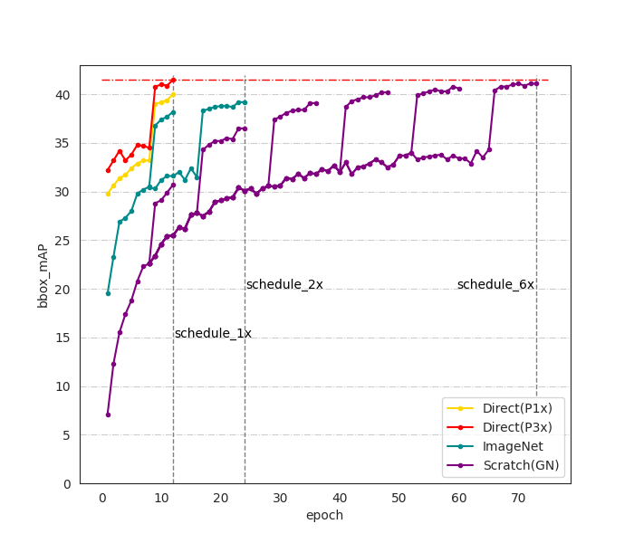

# Rethinking Training from Scratch for Object Detection

## Intro
Code for paper [Rethinking Training from Scratch for Object Detection](https://arxiv.org/abs/2106.03112).

The ImageNet pre-training initialization is the de-facto standard for object detection. He et al. found it is possible to train detector from scratch(random initialization) while needing a longer training schedule with proper normalization technique. In this paper, we explore to directly pre-training on target dataset for object detection. Under this situation, we discover that the widely adopted large resizing strategy e.g. resize image to (1333, 800) is important for fine-tuning but it's not necessary for pre-training. Specifically, we propose a new training pipeline for object detection that follows `pre-training and fine-tuning', utilizing low resolution images within target dataset to pre-training detector then load it to fine-tuning with high resolution images. With this strategy, we can use batch normalization(BN) with large bath size during pre-training, it's also memory efficient that we can apply it on machine with very limited GPU memory(11G). We call it direct detection pre-training, and also use direct pre-training for short. Experiment results show that direct pre-training accelerates the pre-training phase by more than 11x on COCO dataset while with even +1.8mAP compared to ImageNet pre-training. Besides, we found direct pre-training is also applicable to transformer based backbones e.g. Swin Transformer.




## Pre-trained models coming soon!!!

## Installation

This project mainly reference [MMDetection](https://github.com/open-mmlab/mmdetection) codebase and [Swin Transformer](https://github.com/SwinTransformer/Swin-Transformer-Object-Detection). 

- Following [MMDection installation guide](https://github.com/open-mmlab/mmdetection/blob/master/docs/get_started.md) to install mmdetection.
- install [NVIDIA apex](https://github.com/NVIDIA/apex):
```bash
git clone https://github.com/NVIDIA/apex
cd apex
pip install -v --disable-pip-version-check --no-cache-dir --global-option="--cpp_ext" --global-option="--cuda_ext" ./
```

## Usage

### Prepare Dataset

```bash
git clone https://github.com/wxzs5/direct-pretraining.git
cd direct-pretraining

# set dataset path
mkdir data
ln -s path/to/coco_dataset data/

```

### Inference
```bash
# single-gpu testing
python test.py <CONFIG_FILE> <DET_CHECKPOINT_FILE> --eval <EVAL_METRICS>

# multi-gpu testing
./dist_test.sh <CONFIG_FILE> <DET_CHECKPOINT_FILE> <GPU_NUM> --eval <EVAL_METRICS>
```

e.g. 
```bash
./dist_test.sh configs/direct_pretraining/mask_rcnn_r50_fpn_direct_finetune_p1x_1x_coco.py model.pth 8 --eval bbox segm
```

### Train

- pre-training:
```bash
./dist_train.sh <CONFIG_FILE> <GPU_NUM>
```
- fine-tuning:  
```bash
# set config file *load_from* the pre-trained model path
./dist_train.sh <CONFIG_FILE> <GPU_NUM>
```
## Citing Direct Pre-training

if this paper helps you, please consider citing direct pre-training.
```bibtex
@article{yang2021Rethink,
  title={Rethinking Training from Scratch for Object Detection},
  author={Yang, Li and Hong, Zhang and Yu, Zhang},
  journal={arXiv preprint arXiv:2106.03112},
  year={2021}
}
```